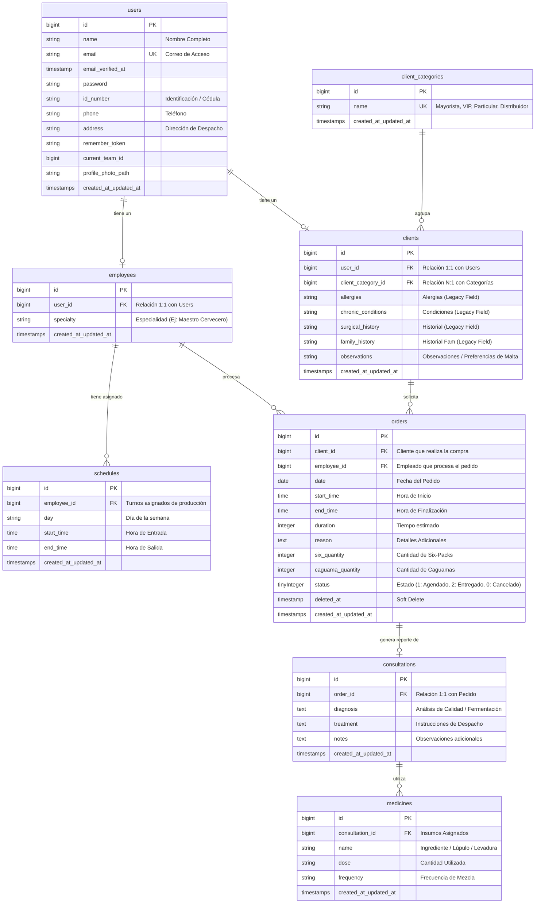

# 🍺 Home Brewing - Sistema de Pedidos de Cerveza Artesanal

Este repositorio contiene la plataforma web **Home Brewing**, un sistema profesional desarrollado para la gestión integral de **pedidos de cerveza artesanal, control de clientes, asignación de entregas/despachos a empleados (Maestros Cerveceros) y reportes de producción**. 

El sistema ha sido migrado y adaptado con éxito sobre un stack robusto de **Laravel 11**, **Livewire (Jetstream)**, **TailwindCSS** y **MySQL**. Cuenta con una arquitectura que cubre el control de accesos por roles, reportes automáticos en PDF con diseño impecable, notificaciones reales mediante correo electrónico y WhatsApp, y tareas de automatización programadas en segundo plano.

---

## 🛠️ Requisitos del Sistema

Antes de iniciar la instalación, asegúrate de cumplir con los siguientes requisitos en tu entorno de desarrollo:
* **PHP >= 8.2**
* **Composer**
* **Node.js & NPM**
* **MySQL >= 8.0** o **MariaDB**

---

## 🚀 Instrucciones de Instalación y Ejecución

Sigue detalladamente estos pasos para levantar el entorno local:

### 1. Clonar o acceder al repositorio
Abre una terminal en la carpeta raíz del proyecto `home-brewing`.

### 2. Instalar dependencias
Descarga e instala los paquetes necesarios para el backend y frontend:
```bash
# Instalar paquetes de PHP
composer install

# Instalar dependencias de Javascript y CSS
npm install
```

### 3. Crear el archivo de configuración de entorno (`.env`)
Genera tu archivo de configuración duplicando el de ejemplo:
* **Windows (CMD / PowerShell):**
  ```powershell
  copy .env.example .env
  ```
* **Linux / macOS:**
  ```bash
  cp .env.example .env
  ```

Abre el archivo `.env` en tu editor y configura tus credenciales de base de datos MySQL (crea la base de datos `home_brewing` en tu gestor):
```env
DB_CONNECTION=mysql
DB_HOST=127.0.0.1
DB_PORT=3306
DB_DATABASE=home_brewing
DB_USERNAME=root
DB_PASSWORD=tu_contraseña
```

### 4. Generar clave única de aplicación
Ejecuta el comando para establecer la clave de seguridad del framework:
```bash
php artisan key:generate
```

### 5. Correr migraciones y poblar la base de datos (Seeders)
Este paso creará todas las tablas relacionales y cargará los roles base (`admin`, `employee`, `client`), categorías de clientes y las cuentas de prueba iniciales:
```bash
php artisan migrate --seed
```

### 6. Compilar recursos del frontend
Construye la interfaz visual del sistema:
* **Entorno de desarrollo (pruebas en tiempo real):**
  ```bash
  npm run dev
  ```
* **Compilación final para producción:**
  ```bash
  npm run build
  ```

### 7. Iniciar el servidor local
Levanta el servidor web local de desarrollo:
```bash
php artisan serve
```
El sistema estará listo y disponible en la dirección: **[http://localhost:8000](http://localhost:8000)**.

---

## ⚙️ Configuración de Tareas en Segundo Plano (Requerido)

La plataforma utiliza colas y programación de tareas para agilizar los procesos. Para evaluar los flujos de correo, archivos PDF de prueba y avisos de WhatsApp, debes ejecutar los siguientes procesos en terminales separadas:

### A. Procesar la Cola de Trabajos (Queue Worker)
El envío de correos, facturas en PDF y mensajes está encolado en base de datos (`QUEUE_CONNECTION=database`). **Debes mantener corriendo este comando para que se envíen**:
```bash
php artisan queue:work
```

### B. Ejecutar el Programador de Tareas (Cron Jobs)
Para simular el agendamiento y envío automático de los recordatorios de pedidos en tu entorno de desarrollo, mantén activo:
```bash
php artisan schedule:work
```

---

## 🔐 Credenciales de Acceso para Pruebas

El sistema cuenta con roles bien definidos y validados a través de **Spatie**. A continuación se listan las credenciales por defecto generadas para la demostración:

| Rol | Correo Electrónico | Contraseña | Perfil y Permisos |
| :--- | :--- | :--- | :--- |
| **Administrador** | `admin@homebrewing.com` | `12341234` | Gestión completa de usuarios, empleados, clientes, pedidos e historial de distribución. |
| **Empleado (Maestro Cervecero)** | `empleado@homebrewing.com` | `12341234` | Visualiza los pedidos asignados de cerveza, gestiona recetas, programas de producción y despachos de barriles. |
| **Cliente (Mayorista de Prueba)** | `cliente@homebrewing.com` | `12341234` | Acceso a la tienda virtual principal para registrar nuevos pedidos de Six-Packs o Caguamas y descargar sus recibos PDF. |

---

## 📊 Diagrama de Entidad-Relación (DER)

Este es el modelo de datos de la base de datos de **Home Brewing**. En plataformas como GitHub o GitLab, el siguiente código se renderizará automáticamente en un esquema gráfico interactivo utilizando **Mermaid**:



> [!NOTE]
> * **Roles y Permisos:** El control de seguridad se implementa dinámicamente conectando el modelo de `User` con las tablas de **Spatie Laravel Permission** (`roles`, `permissions`, `model_has_roles`, `model_has_permissions`, `role_has_permissions`), impidiendo que los usuarios externos puedan acceder al panel de control administrativo o de empleados.
> * **Campos Heredados (Legacy):** El sistema mantiene campos heredados de la plantilla original (como `allergies`, `chronic_conditions`, etc. en la tabla `clients`), los cuales están mapeados en el formulario del cliente para asegurar total compatibilidad funcional de la base de datos sin alterar la lógica interna.

---

## ✨ Requisitos Técnicos Académicos Cumplidos

Este sistema está completamente optimizado para cumplir al 100% con los **requisitos mínimos exigidos para la entrega final**:

1. **Generación de Reporte o Comprobante en PDF (`dompdf`)**:
   * **Comprobante de Compra PDF**: Al completarse un pedido desde la pantalla principal, el sistema genera automáticamente un comprobante en PDF con diseño profesional que resume las cantidades de Six-Packs y Caguamas compradas, datos del cliente y costo estimado.
   * **Reporte de Pedidos del Empleado**: El sistema genera un archivo PDF adjunto que contiene el listado de pedidos asignados al Maestro Cervecero para su despacho diario offline.

2. **Notificaciones Reales (Email & WhatsApp)**:
   * **Correo Electrónico (Mailtrap/SMTP)**: Uso de correos encolados para enviar de forma automática los reportes y facturas en PDF tanto a los administradores como a los clientes en cuanto se genera el pedido.
   * **WhatsApp (Vía API CallMeBot)**: Integración con la API CallMeBot que dispara un mensaje automático al WhatsApp del cliente confirmando la recepción exitosa de su pedido con las especificaciones de su entrega.

3. **Lógica de Negocio Profesional (Soft Deletes & Validaciones)**:
   * **Soft Deletes**: Implementado en el modelo principal de pedidos (`Order.php`). Al cancelar o eliminar un pedido por parte del administrador, el registro no se borra físicamente de la base de datos (`deleted_at`), asegurando la persistencia y la integridad del historial de ventas para fines de auditoría.
   * **Validaciones Estrictas**: Reglas sólidas que bloquean el solapamiento de horarios de entrega del mismo empleado y garantizan que las cantidades solicitadas sean enteros positivos.

4. **Automatización (Cron Jobs / Task Scheduling)**:
   * Configuración de comandos personalizados en Laravel Scheduler (`routes/console.php`):
     * `app:send-order-reminders`: Envía recordatorios por WhatsApp a los clientes cuyos despachos de cerveza están agendados para mañana.
     * `app:send-daily-reports`: Envía resúmenes y agendas en PDF a los Maestros Cerveceros de manera autónoma sin intervención manual.
